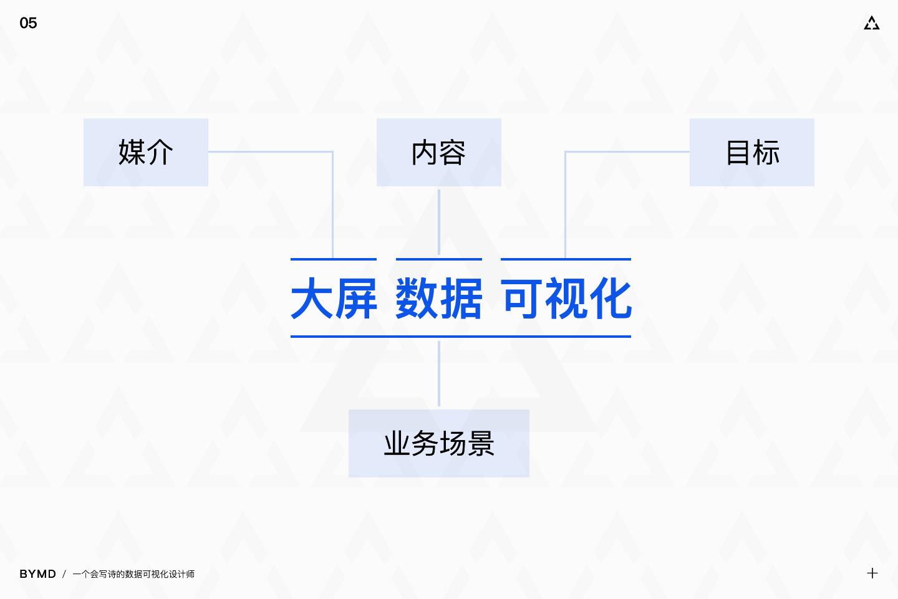

# 前提概要

本数据可视化资料，主要基于前人的一些博文进行整理和结构梳理形成，部分内容摘录自以下博文，如有侵权，请联系我删除。

[大屏数据可视化设计指南](https://www.ui.cn/detail/428629.html)
[大屏监控系统数据可视化界面设计](https://www.ui.cn/detail/392039.html)

## 什么是数据可视化

把相对复杂、抽象的数据通过可视的方式以人们更易理解的形式展示出来的一系列手段叫做数据可视化，数据可视化是为了更形象地表达数据内在的信息和规律，促进数据信息的传播和应用。

> 数据可视化的本质是数据空间到图形空间的映射，是抽象数据的具象表达。

从阿里目前几届双十一的数据可视化大屏来看，目前大屏已经从可视，逐步演变成可动、可交互的程度。

## 什么是大屏数据可视化

大屏数据可视化是以大屏为主要展示载体的数据可视化设计。

大屏数据可视化目前主要有**信息展示**、**数据分析**及**监控预警**三大类。

